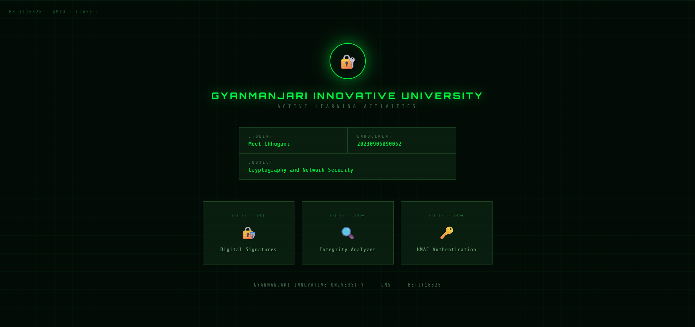
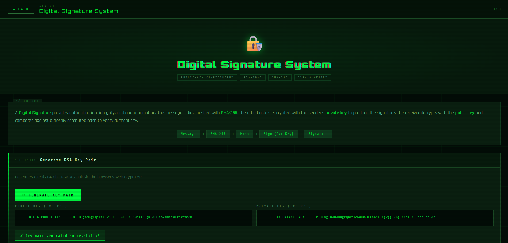
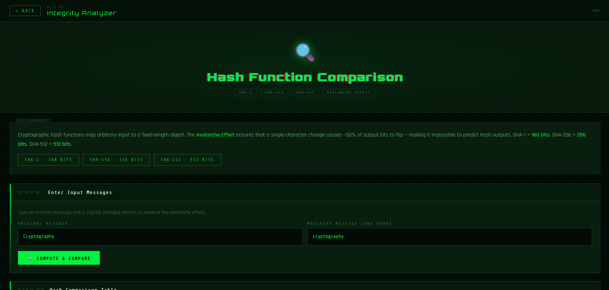
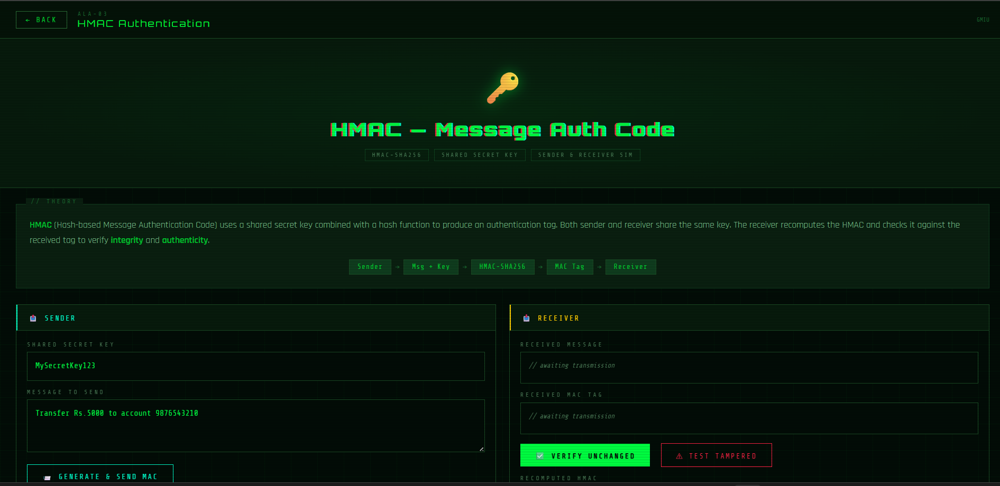

# CNS — Active Learning Activities
### Cryptography and Network Security | BETIT16326

| | |
|---|---|
| **Student** | Meet Chhugani |
| **Enrollment No.** | 20230905090052 |
| **Subject** | Cryptography and Network Security |
| **Subject Code** | BETIT16326 |
| **University** | Gyanmanjari Innovative University |
| **Class** | C |

---

## Overview

A single-file interactive web application built with HTML, CSS, and JavaScript that demonstrates three cryptographic concepts through live, hands-on simulations. All cryptographic operations run entirely in the browser using the native Web Crypto API — no backend, no external libraries, no internet required after loading.

The UI uses a dark cyberpunk / terminal aesthetic with phosphor-green styling, scanline overlays, glitch animations, and monospace fonts.

---

## Screenshots

### Home Screen


### ALA-01 — Digital Signature System


### ALA-02 — Integrity Analyzer


### ALA-03 — HMAC Authentication


---

## ALA-01 — Digital Signature System

### What it does
Demonstrates RSA-2048 digital signature generation and verification using SHA-256 hashing.

### Steps
- Generate a real 2048-bit RSA key pair via the browser's Web Crypto API
- Compute SHA-256 hash of the input message
- Sign the message with the private key using RSASSA-PKCS1-v1_5
- Verify the signature with the public key
- Tamper Test — modifies the message to show signature failure

### Concept
A Digital Signature provides authentication, integrity, and non-repudiation. The message is hashed with SHA-256, encrypted with the sender's private key to produce the signature. The receiver decrypts with the public key and compares hashes to verify authenticity.

---

## ALA-02 — Integrity Analyzer

### What it does
Compares SHA-1, SHA-256, and SHA-512 hash outputs and visualises the avalanche effect with a bit-flip grid.

### Steps
- Enter an original message and a slightly modified version
- Compute SHA-1, SHA-256, SHA-512 hashes for both inputs side by side
- View a Hash Comparison Table with all digests
- Avalanche Effect bar showing percentage of bits flipped
- 256-bit flip grid — red cells = flipped bits, dark cells = unchanged

### Concept
Cryptographic hash functions map arbitrary input to a fixed-length digest. The Avalanche Effect ensures a single-character change causes ~50% of output bits to flip, making hash outputs completely unpredictable.

---

## ALA-03 — HMAC Authentication

### What it does
Simulates a sender-receiver HMAC-SHA256 authentication flow with live tamper detection.

### Steps
- Sender inputs a shared secret key and message
- HMAC-SHA256 tag is generated and transmitted to the Receiver panel
- Receiver recomputes HMAC using the same key and compares tags
- Test Tampered mode modifies the message to demonstrate MAC mismatch

### Concept
HMAC (Hash-based Message Authentication Code) uses a shared secret key combined with SHA-256 to produce an authentication tag. It proves both integrity (message unchanged) and authenticity (only key-holders can generate valid tags).

---

## Tech Stack

| Technology | Usage |
|---|---|
| HTML5 | Structure and layout |
| CSS3 | Cyberpunk theme, animations, scanline effect, grid background |
| Vanilla JavaScript | All logic and DOM manipulation |
| Web Crypto API | RSA key generation, SHA hashing, HMAC signing |
| Google Fonts | Orbitron, Share Tech Mono, Rajdhani |

**No frameworks. No build tools. No dependencies. Open the `.html` file and it works.**

---

## How to Run

```bash
# No installation needed.
# Just open the file in any modern browser:

open index.html          # macOS
start index.html         # Windows
xdg-open index.html      # Linux
```

> Requires a modern browser that supports the Web Crypto API — Chrome, Firefox, Edge, Safari all work.

---

## File Structure

```
index.html          ← Entire application (HTML + CSS + JS in one file)
README.md           ← This file
ss_home.png         ← Screenshot: Home screen
ss_digitial.png     ← Screenshot: ALA-01 Digital Signature
ss_integrity.png    ← Screenshot: ALA-02 Integrity Analyzer
ss_hmac.png         ← Screenshot: ALA-03 HMAC Authentication
```

---

*Gyanmanjari Innovative University · CNS · BETIT16326*
